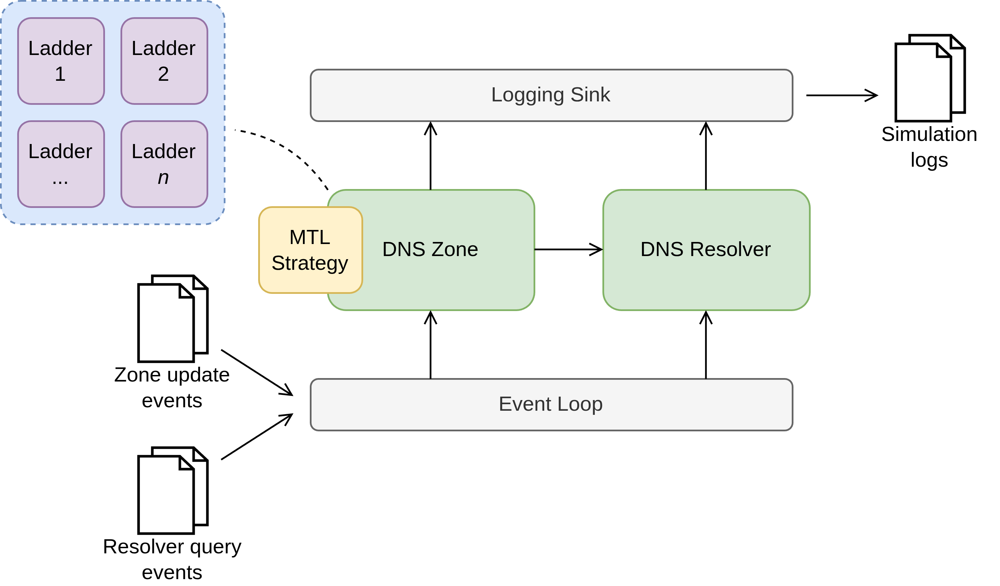

# mtlsim Architecture

The architecture of mtlsim is designed to be modular and extensible. A diagram can be found below, which illustrates the main components of the simulator and how they interact with each other.

