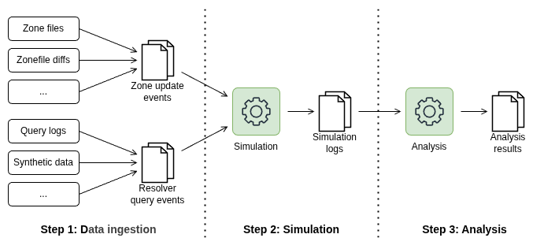

# mtlsim Usage

Installation of mtlsim using one of the [recommended methods](installation.md) will provide you with the `mtlsim` command. This command can be used to run simulations and analyze results.

Use the `mtlsim --help` command to view all available commands and options:

```
mtlsim --help
Usage: mtlsim [OPTIONS] COMMAND [ARGS]...

Options:
  --help  Show this message and exit.

Commands:
  analyze            Analyze the raw logs generated by the simulator and...
  generate-queries   Generate synthetic DNS query events.
  ingest-zone        Ingest a DNS zone file.
  ingest-zone-diffs  Ingest DNS zone diffs in custom parquet format and...
  simulate           Run the simulator.
  strategies         List available ladder strategies.
```

## Workflow

The simulator workflow looks like this:

1. Ingest zone and query events, convert into JSONL format;
2. Run the simulation with the ingested data;
3. Analyze the results.



## Ingest zone events

mtlsim comes with a set of CLI commands to ingest and generate zone and query data from various sources. To view all commands, run `mtlsim --help`.

Zone input data is expected to be in JSONL format:

```json
{"timestamp":"2026-07-20T05:00:00","removed":[],"added":[["example", "DS"], ["example", "NSEC3"]]}
{"timestamp":"2026-07-20T06:00:00","removed":[["example", "DS"]],"added":[["example", "NSEC3"]]}
```

"added" and "removed" are lists of tuples indicating RRSIG records, where each tuple contains a domain name and a record type.
"added" contains RRSIGs that were added or updated, while "removed" contains RRSIGs that were removed.

## Ingest query events

Query / resolver input data is also expected to be in JSONL format:

```json
{"timestamp":"2026-07-20T05:00:00","type": "given", "query_name": "example", "query_type": "DS"}
{"timestamp":"2026-07-20T05:00:01","type": "given", "query_name": "example", "query_type": "DS"}
```

Several fields are available for query events:

```
- given: the event contains the query name and type
- random: the event contains a record type, and the query name is randomly generated from the zone
- random_seeded: same as random, but the random generator is seeded for reproducibility

type: Literal["given", "random", "random_seeded"] = "given"
query_name: str | None
query_type: str | None
seed: str | None
```

## Simulation

Example command to run a simulation:

```bash
mtlsim simulate --zone-input inputs/nl/zone.jsonl --query-input inputs/nl/resolver_1.jsonl --strategy single_inf --tag nl-singleinf-1
```

Results will be written to `logs/<tag>-<timestamp>.jsonl`. The tag is used to identify the simulation run, and the timestamp is automatically generated.

Example output log:

```json
{"timestamp":"2026-03-11T14:00:00","type":"new_ladder","sid":"648628cc-09db-4602-9583-fb3cb47b5b40"}
{"timestamp":"2026-03-11T14:00:00","type":"ladder_add","sid":"648628cc-09db-4602-9583-fb3cb47b5b40","count":9683849}
{"timestamp":"2026-03-11T14:04:00.420860","type":"query","sig_type":"full"}
{"timestamp":"2026-03-11T14:07:54.039826","type":"query","sig_type":"condensed"}
```

## Analyzing results

Analysis can be done with the `mtlsim analyze` command. For example, to analyze all results from the `logs` directory, run:

```bash
mtlsim analyze logs/*.jsonl
```

Analysis results will be written to `output/<tag>.json`. If multiple files with the same tag but different timestamps are provided, analysis will only be done on the latest file.

Example output:

```json
{
  "run_name": "single_inf_0.01",
  "timestamp": "2026-06-12T13:30:20",
  "time_between_fullsig": [
    63653.10127186775,
    87375.85578608513,
    69382.63759803772,
    4492.899500846863
    // (elapsed time in seconds between full signature checks)
  ],
  "queries_between_fullsig": [
    622,
    870,
    687,
    38
    // (number of queries between full signature checks)
  ],
  "ladder_sizes": {
    "f0493d15-1666-41a7-a118-1b9bbb2d37fd": [
      ["2026-03-11T14:00:00", 0],
      ["2026-03-11T14:00:00", 9683849],
      ["2026-03-11T14:30:00", 9684793],
      ["2026-03-11T15:00:00", 9685610]
      // ... [timestamp, integer] pairs
    ]
    // potentially additional ladder UUIDs
  }
}
```